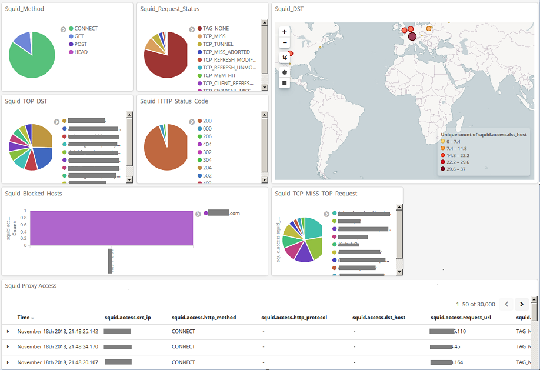
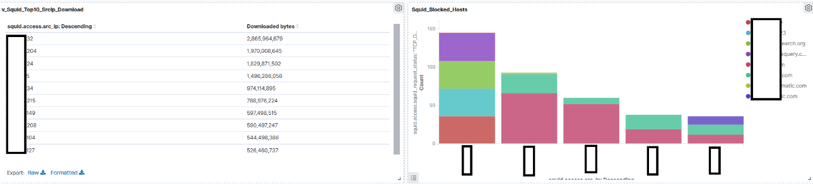

# squid-filebeat-kibana
Filebeat module for Squid access logs + Kibana dashboards. ELK 7.8

<h3> TL;DR<p> </h3>
Collect your squid access.log with Filebeat, send directly to Elasticsearch.
Get overview of Squid access log using Kibana dashboard.






<h4> Elastichsearch and Kibana </h4>
1. Elasticsearch and Kibana
    <p>a.) Install Elasticsearch and Kibana.
    <p>b.) Configure firewall to allow access from filebeat host to elasticsearch service.


<h4> Filebeat + module squid installation </h4>
2. Configuration Filebeat (7.x recommended. Older versions may not work)
   <p>a.) copy filebeat/module/squid into /usr/share/filebeat/module
   <p>b.) copy filebeat/etc/filebeat/modules.d/squid.yml.disabled into /etc/filebeat/modules.d
   <p>c.) configure /etc/filebeat/filebeat.yml - reference file placed in /etc/filebeat/filebeat.yml
        (change  hosts ["elasticsearch.local"] in section output.elastichsearch to elastichsarch instance listening from filebeat host
   <p>d.) enable Filebeat squid module by command "filebeat modules enable squid" (or just rename /etc/filebeat/modules.d/squid.yml.disabled to /etc/filename/modules.d/squid.yml
   <p>e.) Replace /etc/filebeat/fields.yml with filebeat/etc/fields.yml from repo. (Important! - This must be done before run filebeat). This file is a compiled version from 7.3 so the rest of functionality should work. If filebeat with newer definitions is needed then just cut squid section and join into newer field.yml"
   <p>f.) restart Filebeat service - "systemctl restart filebeat"

<h4>Kibana configuration </h4>
3. Import Dashboard definition from kibana folder Kibana (via GUI: Management -> Saved Objects -> import) 

<h4> Check Dashboard view on Kibana </h4>
4. Go to the Dashboard section and find "[Filebeat Squid] Access log". Set Time-Range according to expected log entries.


<h4> Troubleshooting </h4>
<p>Elasticsearch needs to know what types should be applied to particular fields during processing logs.
For all the modules they are available in /etc/filebeat/fields.yml and this repo contains of modified fields.yml filebeat 7.3 with compiled into mappings required for the module squid.
If they are not applied automatically on the Filebeat Index (e.g. index filebeat-* already exist and)
then try to remove index, filebeat ingest pipeline and filebeat mapping.


```bash
cat filebeat/etc/squid-fields.yml >> /etc/filebeat/fields.yml
curl -XDELETE elasticsearch.local:9200/filebeat-index-name
curl -XDELETE elasticsearch.local:9200/_ingest/pipeline/filebeat*squid*
systemctl restart filebeat
```

<h4> TODO: </h4>

<p> - add required elements by Elastic Beats and create pull request to https://github.com/elastic/beats/ - inprogress

